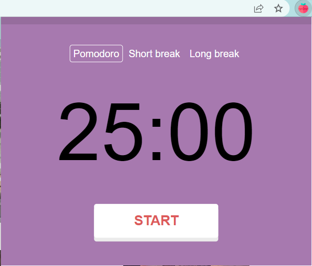
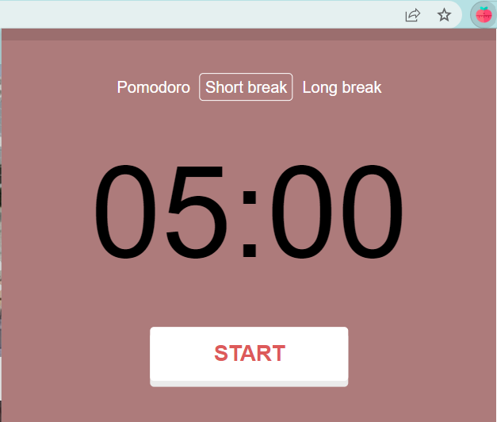
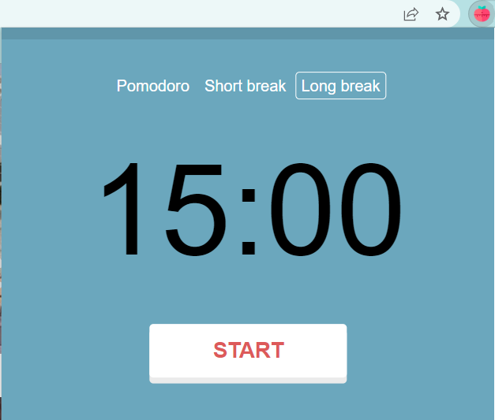

# Pomodoro

A simple pomodoro project with progress bar that can be used as extension

## Features

- `25 minutes timer`
- `Automatic start and stop when timer ends`
- `5 minutes short break and 15 minutes long breaks`
- `Sound when button is click and when the session is switched`
- `Progress bar for each sessions`

## Screenshot

  
  
  

## To be added

- `Able to change time for pomodoro, short and long breaks`
- `Run in background`
- `Insert note`
- `Save data to create productivity report`